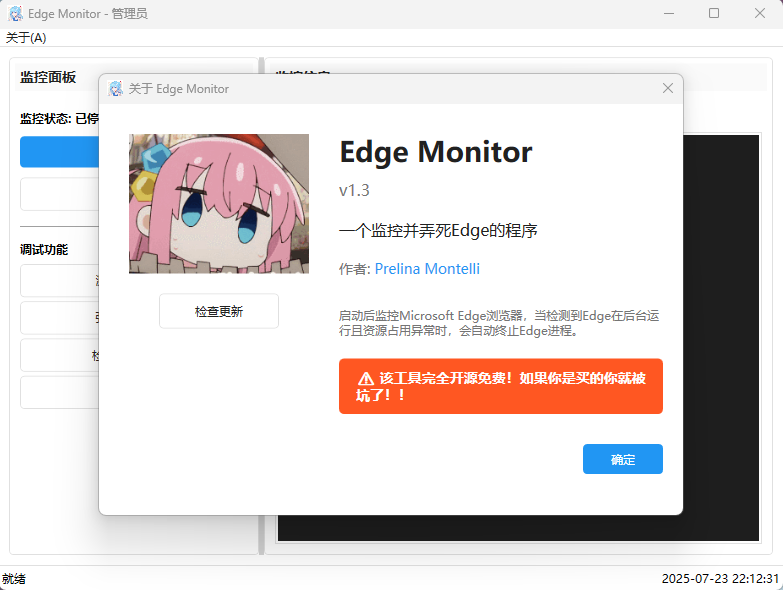

# Edge Monitor

主播发现自己的电脑在启动一些软件或游戏时Edge会在后台自动启动，占用大量内存和CPU时间，故编写本程序来解决这个问题。

这个程序治标不治本，只能结束Edge，无法完全修复自动启动和异常占用的问题

## 条件

程序会在同时满足以下两个条件时自动终止Edge进程：

1. **后台运行状态**：Edge进程正在运行，但没有可见的用户界面窗口
2. **资源占用异常**：满足以下任一条件
   - CPU使用率超过 30%
   - 内存使用量超过 2GB

## 技术栈

- .NET 7
- WPF (Windows Presentation Foundation)
- Microsoft Extensions (DI, Logging, Configuration, Hosting)
- MVVM 模式

## 许可证

本项目采用 CC BY-NC 4.0（Creative Commons Attribution-NonCommercial 4.0 International）许可证。

**阁下可以：**
- ✅ 分享 — 在任何媒介以任何形式复制、发行本作品
- ✅ 演绎 — 修改、转换或以本作品为基础进行创作

**惟须遵守下列条件：**
- 📝 **署名** — 阁下必须给出适当的署名，提供指向本许可协议的链接，同时标明是否（对原始作品）作了修改
- 🚫 **非商业性使用** — 阁下不得将本作品用于商业目的

**原作者：** Prelina Montelli

详细许可条款请参见：https://creativecommons.org/licenses/by-nc/4.0/
